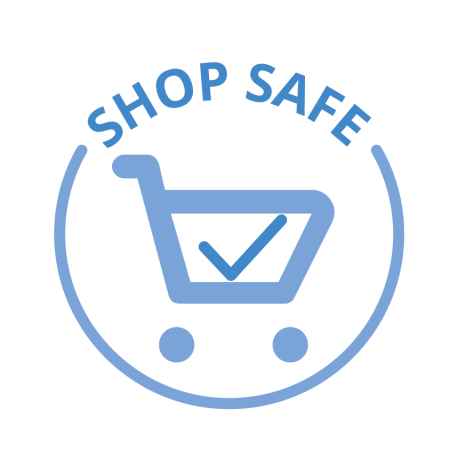
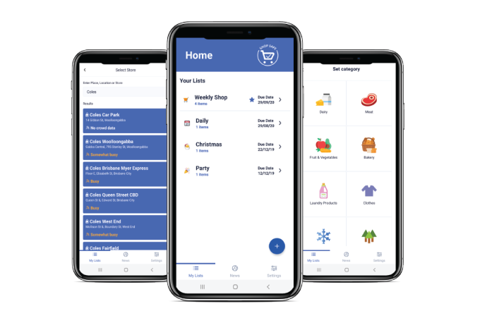

<h2 align="center">An Application to Help You Shop Safely</h2>

&nbsp;

# What is Shop Safe?
Shop Safe is a mobile application designed to fill your shopping list needs while helping reduce your exposure to certain diseases. There is a high demand for safety in public spaces now, so much so that a lot of public spaces have been outright restricted or banned. The shopping store however is one of those places that most people need to go to, in order to be able to buy necessities to continue living at home.

This is where our application comes into play, trying to combine the desire for safety in the pandemic with confidence in going outside to shop. This application offers a convenient shopping list tracker, as well as the ability to route your trip around your chosen supermarket based on what items you have on your list. This is designed to help users minimise their time spent in store, as this is [likely the most risky part of their shopping trip](https://www.cdc.gov/coronavirus/2019-ncov/prevent-getting-sick/how-covid-spreads.html). It also provides certain details about your store to help guide decisions you make in your shopping experience. 

Shop Safe presents a live news feed to get satisitcs specific to the current [COVID-19 pandemic](https://en.wikipedia.org/wiki/Coronavirus_disease_2019), as well as various news articles about the pandemic based on your chosen country. 

&nbsp;

This is a program written in React Native, designed for Android and IOS devices. Some features will not work if permissions aren't granted to the application, or if that sensor is missing in your device. Furthermore, access to the servers we used to present some of the features in our program may no longer become available, which will also make those features unavailable.

This program is a part of the University of Queensland's course, [Design Computing Studio 3 - Build (DECO3801)](https://my.uq.edu.au/programs-courses/course.html?course_code=DECO3801), completed by Zoomie Studios. This was based off of a proposal written by *The Social Distancing Social Club* as a part of [DECO3800](https://my.uq.edu.au/programs-courses/course.html?course_code=DECO3800).

## Zoomie Studios
Name | Experience
------------ | -------------
Laura Pham | User interface, user experience, and front end programming
Jessica Jenkinson | User interface and user experience
Calum Henman | Cyber Security major with programming experience
Theo Duval | Data science and software development
Adrian Cryer | Primarily programming skills, as well as maths and logic
Andy Jie Peng | Programming skills and database experience

&nbsp;

## Client Quickstart

0. Download Git (if you haven't ready got it!): https://git-scm.com/
1. Download Node (>= 12): https://nodejs.org/en/download/

2. Install Expo globally:
`npm install -g expo-cli yarn`

3. Clone this repository: `git clone git@github.com:TeamZoomie/CovidShoppingAssistant.git`\
If you get permission denied, you will have to add an ssh key to your account (Might be able to use one of the git tools).\
**Useful link**: https://docs.github.com/en/enterprise/2.15/user/articles/generating-a-new-ssh-key-and-adding-it-to-the-ssh-agent 

4. Install packages:
`cd client`
`expo install`

5. Install the Expo app on your phone: https://play.google.com/store/apps/details?id=host.exp.exponent&hl=en_AU
6. Start the client: `expo start`
7. Open Expo App on your phone and scan QR code (In terminal / new window that was created)

&nbsp;

## Server Quickstart
### How to connect to the server  
1. Proxy ssh connection
	1. Log into moss
		- `ssh <student number>@moss.labs.eait.uq.edu.au`
	2. Log into web server
		- `ssh <student number>@deco3801-zoomie.zones.eait.uq.edu.au`
2. Using VPN (I haven't testing this working)
	1. Install UQ VPN or EAIT VPN
	2. `ssh <student number>@deco3801-zoomie.zones.eait.uq.edu.au`

### Web Server Location
`https://deco3801-zoomie.uqcloud.net/`

### Add a user and obtain token
Please follow the following steps to create a user and obtain a token
1. Use a POST request to http://deco3801-zoomie.uqcloud.net/usercreate/
	- Needs to contain the Username and Password of the user
	- {"username": "", "password": ""}
	- `curl -X POST --data "username=[username]&password=[password]" http://deco3801-zoomie.uqcloud.net/usercreate/`
2. Organize to grab a token from the API using the username and password
	- `curl -X POST --data "username=[username]&password=[password]" http://deco3801-zoomie.uqcloud.net/api-token-auth/`
3. On all following API requests to the list directory. Add the following header to the requests
	- Header: "Authorization: Token [token]"
	- Example: `curl -H "Authorization: Token [token]" http://deco3801-zoomie.uqcloud.net/list/`
